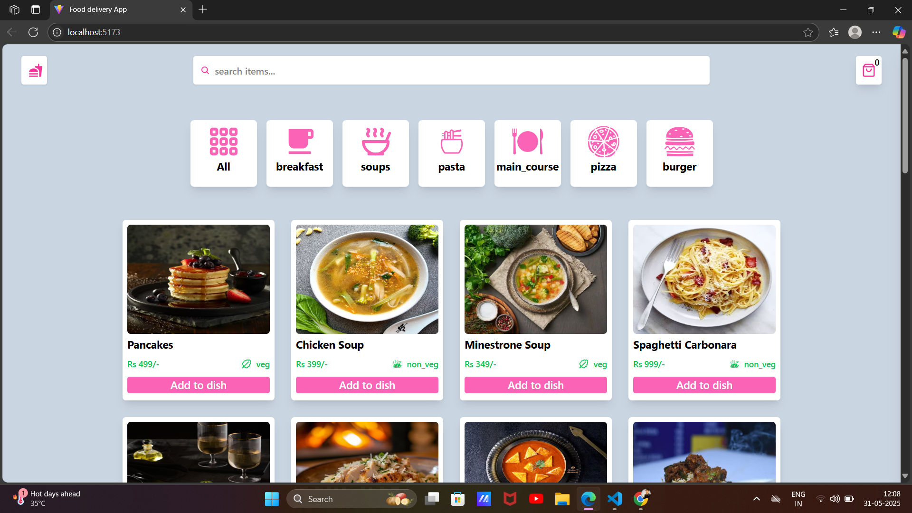
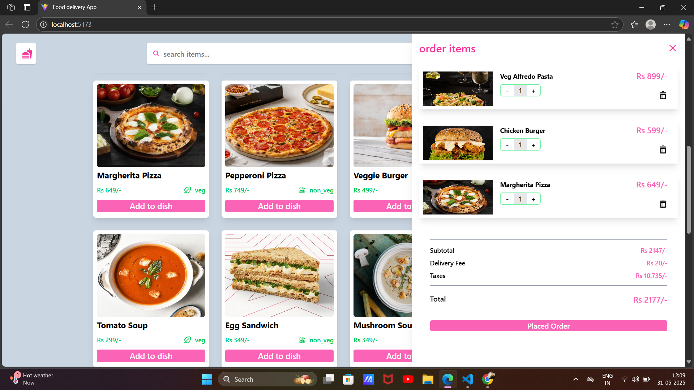

# 🍔 Food Delivery App

A sleek and responsive **Food Delivery Web App** built with **React 19**, **Redux Toolkit**, **Tailwind CSS**, and **Vite**. Users can browse food items, filter by categories, search for meals, manage a cart, and place an order.

---

## 🚀 Live Demo

> (https://food-delivery-app-sumantsingh08s-projects.vercel.app/)

---

## 📸 Screenshots

### 🏠 Home Page

### 🛒 Cart with Items

---

## 🛠️ Tech Stack

- ⚛️ **React 19**
- 🧰 **Redux Toolkit**
- 🚦 **React Router DOM v7**
- 💨 **Tailwind CSS v4**
- 🔔 **React Toastify**
- ⚡ **Vite**

---

## ✨ Features

- 🗂️ Category-based food filtering
- 🔍 Search functionality
- 🍱 Beautiful meal cards
- 🛒 Add/remove items in cart
- 🧾 Live subtotal, taxes, delivery, and total calculation
- ✅ Order placement with toast notification
- 📱 Fully responsive UI

---

